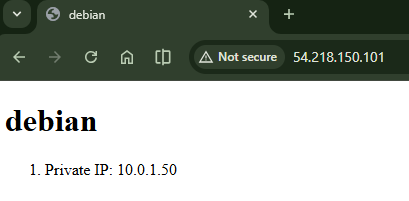

# 4640-ansible-roles-lab
- Thomas
- Charley

## Overview
This repository contains a refactored Ansible configuration that provisions two AWS EC2 instances created via Terraform. The original configuration is modularized into two distinct roles:

- **frontend**: Installs and configures an NGINX web server on Debian instnace serving a custom HTML template.
- **redis**: Installs a Redis Server on a Rocky Linux instance.

## Ansible Commands

**_NOTE_**: Need to install python3 botocore and boto3 to run the playbook successfully.

- `ansible-lint`: The command checks the Ansible playbook and roles for best practices and potential issues

- `ansible-playbook playbook.yml`: The command executes the Ansible playbook, which applies the defined configurations to the target hosts.

## Screenshot

